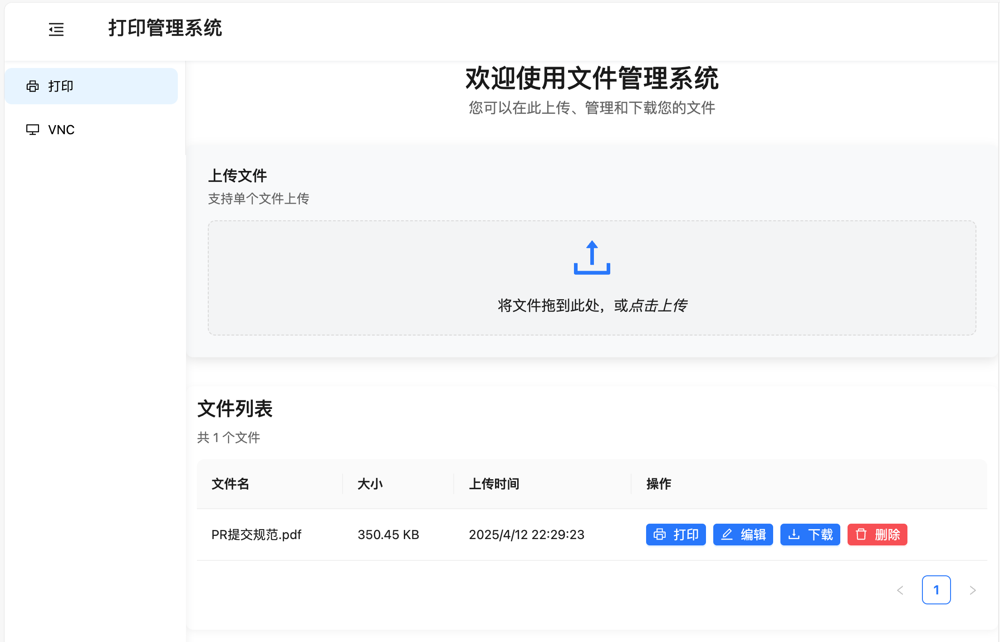

# MiniProject printer_service

## 项目简介

MiniProject printer_service 是一个简易的打印与远程编辑软件，能够实现简单的多人共享文件打印需求。



## 技术栈

- **后端**: Go
- **前端**: Vue 3 + TypeScript

## 功能特性

1. **文档打印**  
    - 支持通过调用 WPS 和 Acrobat 实现 Word 和 PDF 文件的打印。

2. **WebVNC 支持**  
    - 集成基于 noVNC 的 WebVNC 功能。
    - 内置 WebSocket 到 TCP 的转换模块，支持添加其他设备的 VNC 地址进行远程连接。

3. **远程编辑**
    - 通过 VNC 远程连接功能，在远程电脑上打开对应文件，实现文档的编辑操作。

## 快速开始

### 环境要求

- Node.js
- Go == 1.24.1
- 浏览器支持：现代浏览器（推荐 Chrome）

### 安装与运行

1. 克隆项目代码：
    ```bash
    git clone https://github.com/FlySky-z/printer_service.git
    cd printer_service
    ```

2. 安装前端依赖并启动：
    ```bash
    cd frontend
    npm install
    npm run build
    ```

3. 启动后端服务：
    ```bash
    cd ..
    go run main.go
    ```

4. 打开浏览器访问：
    ```
    http://localhost:80
    ```

## 项目结构

```
printer_service/
├── /              # 后端代码（Go 实现）
├── frontend/      # 前端代码（Vue 3 + TypeScript 实现）
└── README.md      # 项目说明文件
```

## 贡献指南

欢迎对本项目进行贡献！请提交 Issue 或 Pull Request。

## 许可证

本项目基于 [MIT License](LICENSE) 开源。
